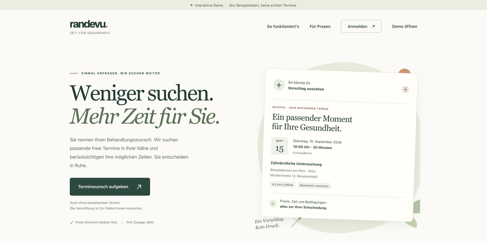

# randevu

### Ein Terminwunsch. Mehr Möglichkeiten.

**Status: Erster interaktiver Prototyp · In Entwicklung · Stand: September 2026**

Ich entwickle randevu als eigenes Digital-Health-Projekt für Deutschland: Patientinnen und Patienten hinterlegen ihren Terminwunsch; Praxen und Kliniken melden freie Zeitfenster. Der Prototyp zeigt, wie daraus passende Terminvorschläge entstehen und wie Patientinnen und Patienten vor einer Bestätigung selbst entscheiden.

> Diese Projektvorstellung zeigt ausschließlich synthetische Beispieldaten. randevu ist noch kein öffentlich nutzbarer medizinischer Dienst. Die abgebildeten Termine sind nicht buchbar. „randevu“ ist ein vorläufiger Arbeitsname.

**Demoansicht, kein Live-Angebot.** Die sichtbaren Oberflächentexte – einschließlich Aussagen zur Vermittlung und zu Kosten – veranschaulichen das Produktkonzept im Prototyp. Daraus entsteht kein buchbares oder bereits verfügbares Leistungsangebot.

## Die Produktidee

Wer einen Behandlungstermin sucht, soll seinen Wunsch einmal hinterlegen können, statt mehrere Praxen wiederholt anzufragen. Freie oder kurzfristig frei gewordene Zeitfenster sollen zu passenden Anfragen finden. Ob dies im Praxisalltag den gewünschten Nutzen bringt, muss in einem späteren Pilotbetrieb geprüft werden.

## Was der Prototyp demonstriert

- Einen Terminwunsch mit gewünschter Leistung, Entfernung und zeitlicher Verfügbarkeit erfassen.
- Freie Zeitfenster aus Sicht einer Praxis bereitstellen.
- Passende Vorschläge und zeitliche Alternativen unter Berücksichtigung fester Grenzen anbieten.
- Ort, Zeit und Bedingungen vor der Entscheidung prüfen und einen Vorschlag bestätigen.
- Unterschiedliche Fachrichtungen berücksichtigen, darunter Zahnmedizin, Physiotherapie und ästhetische Medizin.
- Getrennte, mobil nutzbare Oberflächen für Patientinnen und Patienten sowie Praxen verwenden.

## Mein Beitrag

Produktkonzept, Gestaltung der Nutzerabläufe und Entwicklung des Prototyps. Im Mittelpunkt stehen eine verständliche Terminvermittlung und eine ruhige, klare Benutzeroberfläche, in der die Entscheidung bei der suchenden Person bleibt.

## Öffentlicher Umfang

Diese Seite ist eine Portfoliovorstellung mit einer ausgewählten Demoansicht. Der Anwendungscode bleibt privat; diese Veröffentlichung enthält keine Zugangsdaten, echten Patientendaten oder internen Implementierungsunterlagen. Ein öffentlicher Testzugang wird hier nicht angeboten.

## English summary

randevu is an early appointment-matching prototype for Germany, currently in development. It demonstrates patient requests, practice availability, appointment suggestions and patient confirmation using synthetic example data. This portfolio page is a product preview, not a publicly available medical service; the application source code remains private.

[Zurück zum Portfolio von Imamali Seyidov](../../README.md)
